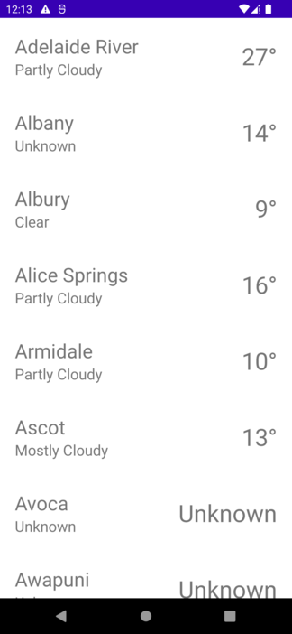

## Demo repository for Android app
The app queries city weather data from remote json and displays the result in a simple list

### Project details:
* Multi-module structure
* Clean architecture
* Kotlin based
* MVVM pattern
* Dagger Hilt
* Retrofit
* Coroutines

### What's not completed
Due to time constraints (spent ~2.5 hrs), most of the requested features were not implemented.
The focus was on setting up the project structure and implementing the functionality of pulling the data from remote repository.
If requested, I can implement the missing features. Please do let me know

### What can be potentially improved:
* Implementing the functionality
* Implementing a better UI design
* Unit tests
* UI tests
* Moving to Jetpack Compose
* MVI pattern

### Screenshot:
